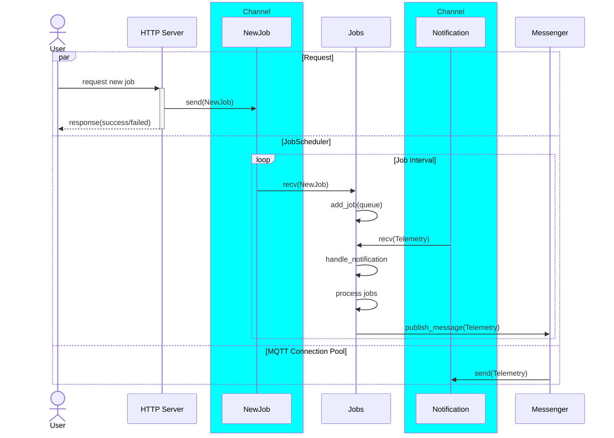
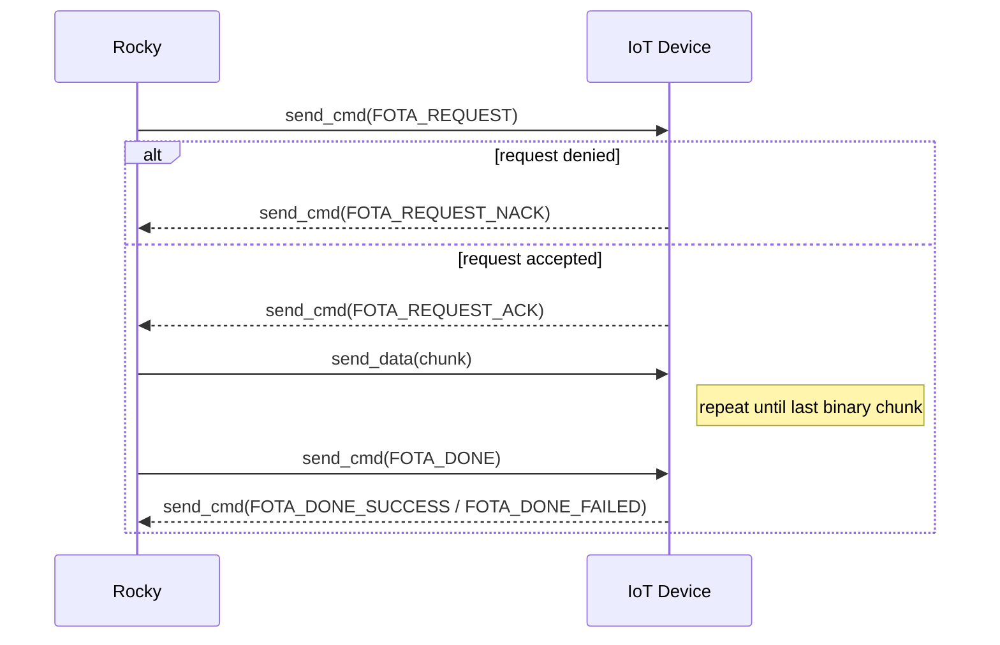

# Rocky

  

## Description

A simple backend service for managing Over-The-Air (OTA) firmware updates via MQTT written in rust. Designed as a job scheduler, it handles multiple firmware update requests simultaneously, with each job maintaining its own status. 

> This is my learning project while studying Rust. While error handling still bad, it already demonstrates how OTA firmware updates happen through MQTT. It's sufficient for testing and learning purposes. In the future, I plan to improve it for use in a production environment. 

## How it works?

It has 3 threads which are the main entity in this project `httpserver`, `jobs` and `messenger`. 

- `httpserver` → where user able to create new job through http request
- `jobs` → manage job schedule in 1 thread. It will process through a list of _in-progress_ job consecutively, set job that still _on-queue_ to _in-progress_ list and set job that is finished to _success_ or _failed_ status. 
- `messenger` → handle mqtt connection pool, publish messages and forward notification to jobs 

### Processing Job 

Each job is processed as shown in the diagram below:

### Channel

There are 2 channel for communication between threads. **Notification** channel to send incoming message from `messenger` to `jobs` thread and **NewJob** channel to send new job from `httpserver` to `jobs` thread.

### MQTT Topic and Payload

#### Command

There are 2 command topic

- `/fota/cmd/{device_id}` → where service send fota command request to device
- `/fota/cmd_resp/{device_id}` → where device respond fota command to service 

**Payload**

For command request, payload is encoded using cbor, with plain text as follow 

`[{job_id}, {command_type}, [{image_hash}]]`

`image_hash` is device firmware binary hashed using sha256, so `image_hash` value is alwasy 32 bytes. Also, `image_hash` only send for command type `FOTA_REQUEST`.

**Command Type**

|Command Type|Value|Topic
|------------|-----|-----|
|FOTA_REQUEST|0x01 |`cmd`|
|FOTA_REQUEST_ACK|0x02 |`cmd_resp`|
|FOTA_REQUEST_NACK|0x03 |`cmd_resp`|
|FOTA_DONE|0x04 |`cmd`|
|FOTA_DONE_SUCCESS|0x05 |`cmd_resp`|
|FOTA_DONE_FAILED|0x06 |`cmd_resp`|

### Device Dummy

## How to run

blablabla
